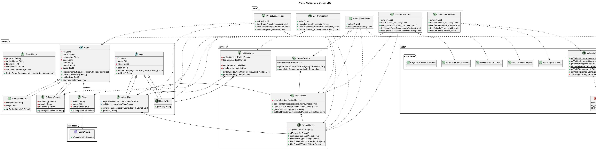

# Java Project Management System

A **Java-based Project Management System** that enables users to manage projects and tasks, track progress, and generate status reports. The system supports **Admin** and **Regular** users with role-based permissions, robust input validation, and custom exception handling.

---

## ✅ Features

### **Project Management**

* Add new projects (Software or Hardware)
* Filter projects by type or budget range
* View detailed project information

### **Task Management**

* Add, update, and remove tasks
* Track task completion status
* Validate task IDs and statuses

### **User Management**

* Switch between Admin and Regular users
* Role-based permissions
* Simplified login functionality

### **Reporting**

* Generate project status reports
* Calculate completion percentage and average completion
* View task details per project

### **Input Validation**

* Handles invalid input gracefully
* Supports numeric, string, status, and ID validation

### **Exception Handling**

* Custom exceptions for tasks, projects, and invalid inputs

---

## 🌱 Git Setup & Usage

You can run this project directly from GitHub by cloning the repository.

### **1. Clone the Repository**

```bash
git clone https://github.com/MaveWRLD/project-management-system.git
```
### **2. Navigate Into the Project Folder**

```bash
cd <your-repo-name>
```

### **3. Build & Compile the Project**

If you’re using raw Java:

```bash
javac -d out $(find src -name "*.java")
```

If you're using Maven:

```bash
mvn clean install
```

### **4. Run the Application**

Raw Java:

```bash
java -cp out ConsoleMenu
```

Maven:

```bash
mvn exec:java
```

### **5. Run Tests**

If the project uses Maven:

```bash
mvn test
```

If testing manually through IntelliJ:

* Open the project
* Right-click **test/java/** → **Run Tests**

### **6. Pull Updates Anytime**

```bash
git pull
```


## 🏗 Architecture

The system is organized into the following **packages**:

```
models/
  Project (abstract): Base class for all projects
  SoftwareProject / HardwareProject: Specialized project types
  Task: Represents individual tasks
  User (abstract): Base class for users
  AdminUser / RegularUser: Role-specific implementations
  StatusReport: Holds reporting data

interfaces/
  Completable: Implemented by Task to check completion

services/
  ProjectService: CRUD for projects
  TaskService: CRUD for tasks and status updates
  ReportService: Generates reports and metrics
  UserService: Handles user switching

utils/
  ValidationUtils: Input validation helpers
  Status: Enum for task statuses (PENDING, IN_PROGRESS, COMPLETED)
  exceptions/ (custom exception classes)
    - InvalidInputException
    - TaskNotFoundException
    - ProjectNotFoundException
    - EmptyProjectException
    - ProjectNotCreatedException
```

---

## 🧪 Test Suite (JUnit)

This project includes a complete automated test suite covering **TaskService**, **UserService**, and their behavior under normal and exceptional conditions.

### **✔ TaskService Tests**

Covers:

* Adding tasks to a project
* Updating task status
* Handling invalid IDs and empty project states

**Test methods include:**

* `testAddTask_success()`
* `testUpdateTaskStatus_success()`
* `testUpdateTaskStatus_emptyProject()`
* `testUpdateTaskStatus_taskNotFound()`

**Test methods include:**

* `testAdminUserInitialization()`
* `testSwitchUser_fromAdminToRegular()`
* `testSwitchUser_fromRegularToAdmin()`

### **How to Run Tests**

```bash
# Run all tests
mvn test
```

Or if using IntelliJ:

* Right-click the **test** folder → **Run 'All Tests'**

---

## 📊 UML Diagram Overview

The design is represented in a **class diagram**:



### **Inheritance**

* `SoftwareProject` & `HardwareProject` → `Project`
* `AdminUser` & `RegularUser` → `User`
* `Task` implements `Completable`

### **Composition / Aggregation**

* `Project` contains multiple `Task` objects
* `AdminUser` holds `TaskService` and `ProjectService`
* `ReportService` uses `TaskService` internally

### **Dependencies**

* `ConsoleMenu` depends on services, utils, models, enums, and exceptions
* Validation methods throw/catch `InvalidInputException`
* Services throw project/task-specific exceptions for robustness

---

## ▶ Running the System

### **Compile & Run**

```bash
# Compile all Java files
javac -d out $(find src -name "*.java")

# Run the main entry point
java -cp out ConsoleMenu
```

### **Usage Flow**

* Manage projects (add, filter, view)
* Add, update, or remove tasks
* View status reports
* Switch between Admin and Regular users

---

## 🧪 Example Usage

```
JAVA PROJECT MANAGEMENT SYSTEM
Current User: Jacob Quaye (Admin)

1. Manage Projects
2. Manage Tasks
3. View Status Reports
4. Switch User
5. Exit
Enter your choice:
```

Examples:

* Admin creates a software project, assigns tasks, and updates their status
* Regular user views project reports and task completion percentages

---

## ⚠ Exception Handling

All inputs are validated through `ValidationUtils`, and any invalid input or state triggers the appropriate **custom exception**, including:

* `InvalidInputException` — wrong data type or format
* `EmptyProjectException` — task operations on an empty project
* `TaskNotFoundException` — non-existent task ID
* `ProjectNotFoundException` — non-existent of Project found
* `ProjectsNotFoundException` — no projects repository


These exceptions are surfaced in services and shown as friendly messages in the `ConsoleMenu`.

---

## 🔮 Future Improvements

* Add persistent storage (database) instead of in-memory arrays
* Develop a GUI for better user interaction
* Add authentication with password-based login
* Support multi-user sessions

---

## 🙌 Author

**Jacob Quaye**
